# 签署您的应用

Android 要求所有 APK 必须先使用证书进行数字签署，然后才能安装。Android 官网说明：[Sign your app][1]。


## 目录

* [目录](#目录)
* [证书和密钥库](#证书和密钥库)
* [签署您的调试构建](#签署您的调试构建)
* [使用 Android Studio 构建和签署您的应用](#structure_sign_use_android_studio)

  * [生成应用签名](#create_sign_use_android_studio)
  * [使用 Android Studio 签署您的应用](#sign_use_android_studio)

    * [手动签署](#sign_use_android_studio_hand)
    * [配置 Gradle 自动签署](#sign_use_android_studio_gradle)

  * [以不同方式签署每个产品风味](#以不同方式签署每个产品风味)
  * [从您的构建文件中移除签署信息](#从您的构建文件中移除签署信息)

* [从命令行构建和签署您的应用](#structure_sign_use_command_line)

  * [使用 keytool 生成应用签名](#create_sign_use_command_line)
  * [从命令行签署您的应用](#sign_use_command_line)

    * [构建未签署 APK 并签署 APK](#structure_unsigned_apk_and_signed_apk)
    * [配置 Gradle 签署](#sign_use_command_line_gradle)
    
* [Android 7.0 - APK signature scheme v2](#sign_scheme_v2)

  * [手动签署 - 仅用传统方案签署](#sign_scheme_v2_android_studio_hand)
  * [配置 Gradle 签署 - 仅用传统方案签署](#sign_scheme_v2_command_line_gradle)

* [运行您的应用](#运行您的应用)

  * [在模拟器上运行您的应用](#在模拟器上运行您的应用)

    * [创建模拟器](#创建模拟器)
    * [命令行安装](#命令行安装)

  * [在设备上运行您的应用](#在设备上运行您的应用)

* [发布您的应用](#发布您的应用)

  * [准备要发布的应用](#准备要发布的应用)
  * [向用户发布应用](#向用户发布应用)


## 证书和密钥库

公钥证书（也称为数字证书或身份证书）包含公钥/私钥对的公钥，以及可以标识密钥所有者的一些其他元数据（例如名称和位置）。证书的所有者持有对应的私钥。


## 签署您的调试构建

从 IDE 中运行或调试您的项目时，Android Studio 将自动使用通过 Android SDK 工具生成的调试证书签署您的 APK。
当您在 Android Studio 中首次运行或调试项目时，IDE 将自动在 $HOME/.android/debug.keystore 中创建调试密钥库和证书，并设置密钥库和密钥密码。

**调试证书的有效期**

用于针对调试签署 APK 的自签署证书的有效期为 365 天，从其创建日期算起。当此证书到期时，您将收到一个构建错误。

若要修复此问题，删除 debug.keystore 文件即可。文件存储在以下位置：

* ~/.android/（OS X 和 Linux）
* C:\Documents and Settings\<user>\.android\（Windows XP）
* C:\Users\<user>\.android\ （Windows Vista，Windows 7、8 和 10）

当您下次构建和运行调试构建类型时，这些构建工具将重新生成新的密钥库和调试密钥。请注意，您必须运行应用，单纯的构建不会重新生成密钥库和调试密钥。

> 注：调试密钥的密码是：android。


<h2 id="structure_sign_use_android_studio">使用 Android Studio 构建和签署您的应用</h2>

<h3 id="create_sign_use_android_studio">生成应用签名</h3>

1. 在菜单栏中，点击 Build > Generate Signed APK。
2. 从下拉菜单中选择一个模块，然后点击 Next。
3. 点击 Create new 以创建一个新密钥和密钥库。
4. 在 New Key Store 窗口上，为您的密钥库和密钥提供以下信息。

    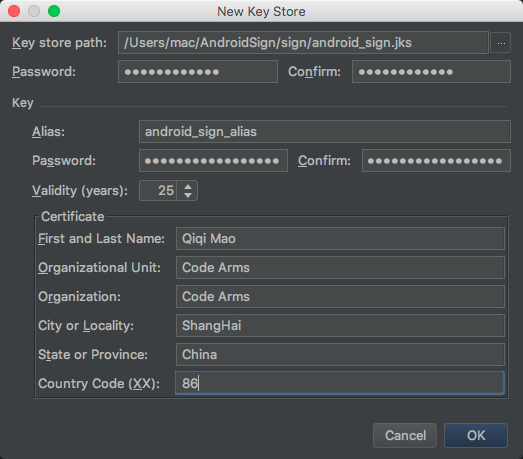

    **密钥库**
    * Key store path：选择创建密钥库的位置。
    * Password：为您的密钥库创建并确认一个安全的密码。

    **密钥**
    * Alias：为您的密钥输入一个标识名。
    * Password：为您的密钥创建并确认一个安全的密码。此密码应当与您为密钥库选择的密码不同。
    * Validity (years)：以年为单位设置密钥的有效时长。密钥的有效期应至少为 25 年，以便您可以在应用的整个生命期内使用相同的密钥签署应用更新。
    * Certificate：为证书输入一些关于您自己的信息。此信息不会显示在应用中，但会作为 APK 的一部分包含在您的证书中。

      * First and Last Name：名字
      * Organizational Unit：公司或组织
      * Organization：组织
      * City or Locality：城市或地区
      * State or Province：州或省
      * Country Code(XX)：国家代码

    填写完表单后，请点击 OK。

<h3 id="sign_use_android_studio">使用 Android Studio 签署您的应用</h3>

<h4 id="sign_use_android_studio_hand">手动签署</h4>

1. 点击 Build > Generate Signed APK 以打开 Generate Signed APK 窗口。（如果您刚刚按上述说明生成了一个密钥和密钥库，则此窗口已处于打开状态。）
2. 在 Generate Signed APK Wizard 窗口上，选择一个私钥，并为它们输入密码。（如果您刚刚在上一部分中创建密钥库，这些字段将自动填充。）然后，点击 Next。

    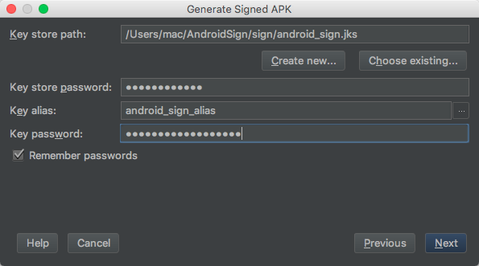

3. 在下一个窗口上，为签署的 APK 选择一个目的地、选择构建类型、选择产品风味（如果适用），然后点击 Finish。

    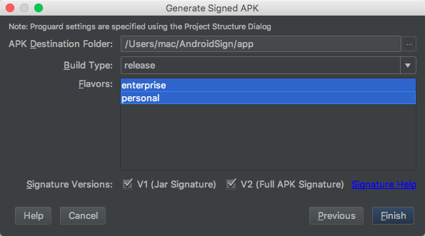<br>

    > 注：如果您的项目使用多个产品风味，那么在 Windows/Linux 上按住 Ctrl 键或者在 Mac OS X 上按住 Command 键可以选择多个产品风味。
    Android Studio 将为选择的每个产品风味生成单独的 APK。

    在流程完成后，您会在上面选择的目标文件夹中找到签署的 APK。

<h4 id="sign_use_android_studio_gradle">配置 Gradle 自动签署</h4>

1. 在 Project 窗口中，右键点击您的应用并点击 Open Module Settings。
2. 在 Project Structure 窗口左面板中的 Modules 下，点击您想要签署的模块。
3. 点击 Signing 标签，然后点击 + 。
4. 选择您的密钥库文件，为此签署配置输入一个名称（因为您可能创建多个配置），然后输入所需的信息。

    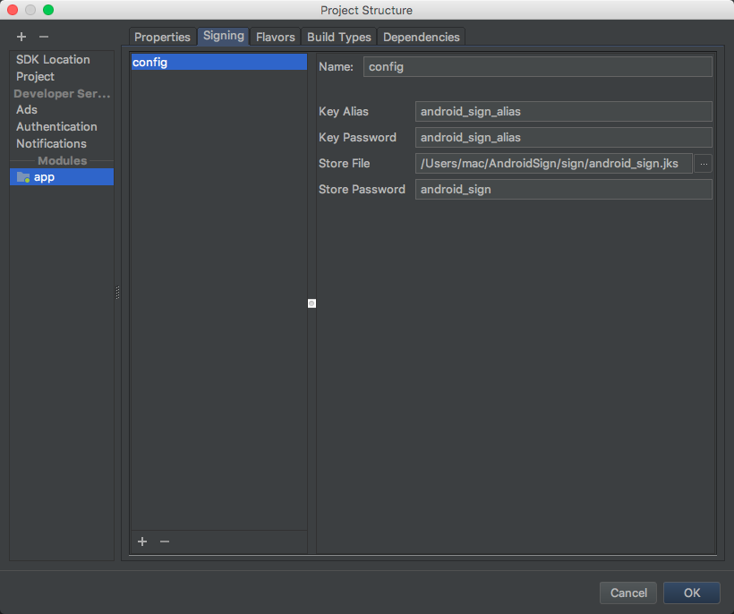

5. 点击 Build Types 标签。然后点击 release 。
6. 在 Signing Config 下，选择您刚创建的签署配置。

    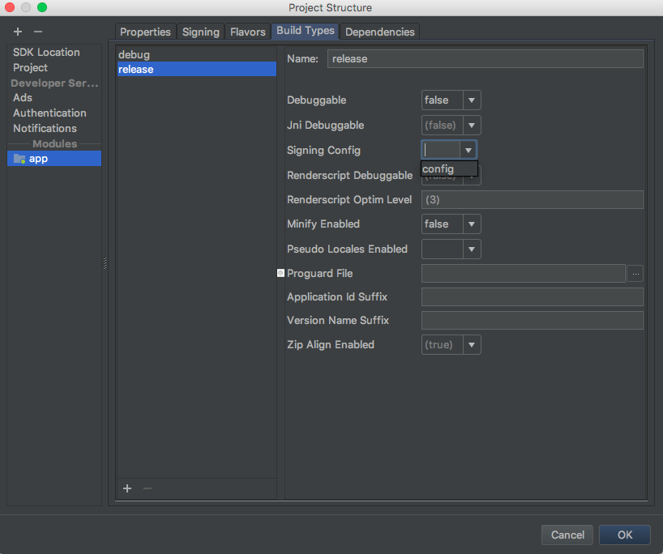

7. 点击 OK。
8. 打开 Build Variants 工具窗口并确保已选择发布构建类型。
9. 点击 Build > Build APK(s) 以构建您的发布构建。

现在，在您每一次使用 Android Studio 构建发布构建时，IDE 都会使用您指定的签署配置自动签署 APK。
您可以在所构建模块项目目录内部的 build/outputs/apk/ 文件夹中找到签署的 APK。


### 以不同方式签署每个产品风味

1. 按照配置构建流程以自动签署 APK(#配置构建流程以自动签署 APK)前四步创建一个签署配置。如果需要，请重复第 3 步和第 4 步，直到您完成所有签署配置的创建。
2. 点击 Flavors 标签。
3. 点击您想要配置的风味，然后从 Signing Config 下拉菜单中选择合适的签署配置。

    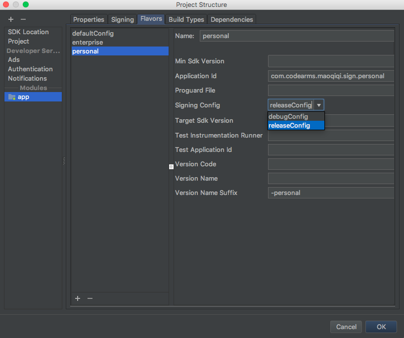

    重复操作以配置任何其他产品风味。

4. 点击 OK。

### 从您的构建文件中移除签署信息

在您创建签署配置时，Android Studio 会以纯文本形式将您的签署信息添加到模块的 build.gradle 文件中。
如果您是团队协作开发或者将您的代码开源，那么您应当将此敏感信息从构建文件中移出，以免被其他人轻易获取。

为此，您应创建一个单独的属性文件来存储安全信息并按以下步骤操作，在您的构建文件中引用该文件：

1. 创建一个签署配置，并将其分配至一个或多个构建类型。
2. 在项目的根目录下创建一个名为 keystore.properties 的文件。此文件应当包含您的签署信息，如下所示：

    ```
    storeFile=../sign/android_sign.jks
    storePassword=android_sign
    keyAlias=android_sign_alias
    keyPassword=android_sign_alias
    ```

3. 在模块的 build.gradle 文件中，于 android {} 块的前面添加用于加载 keystore.properties 文件的代码。

    ```
    ...

    // Create a variable called keystorePropertiesFile, and initialize it to your
    // keystore.properties file, in the rootProject folder.
    def keystorePropertiesFile = rootProject.file("keystore.properties")

    // Initialize a new Properties() object called keystoreProperties.
    def keystoreProperties = new Properties()

    // Load your keystore.properties file into the keystoreProperties object.
    keystoreProperties.load(new FileInputStream(keystorePropertiesFile))

    android {
        ...
    }
    ```

    > 注：您可以选择将 keystore.properties 文件存储在其他位置（例如，存储在模块文件夹中而不是项目的根文件夹中，或者如果您使用持续集成工具，也可以存储在构建服务器上）。
    在这种情况下，您应当修改上面的代码，以便使用实际 keystore.properties 文件的位置正确初始化 keystorePropertiesFile。

4. 您可以使用语法 keystoreProperties['propertyName'] 引用存储在 keystoreProperties 中的属性。
修改模块 build.gradle 文件的 signingConfigs 块，以便使用此语法引用存储在 keystoreProperties 中的签署信息。

    ```
    android {
        signingConfigs {
            config {
                storeFile file(keystoreProperties['storeFile'])
                storePassword keystoreProperties['storePassword']
                keyAlias keystoreProperties['keyAlias']
                keyPassword keystoreProperties['keyPassword']
            }
            ...
        }
        ...
    }
    ```

由于您的构建文件不再包含敏感信息，您现在可以将其包含在源控制中或者上传到共享的代码库。务必保证 keystore.properties 文件的安全。

**警告**：将密钥库和私钥存放在安全可靠的地方，并确保您为其创建了安全的备份。


<h2 id="structure_sign_use_command_line">从命令行构建和签署您的应用</h2>

<h3 id="create_sign_use_command_line">使用 keytool 生成应用签名</h3>

```
keytool -genkey -v -keystore my.jks -keyalg RSA -keysize 2048 -validity 10000 -alias my_alias
```

> 注：keytool 位于 JDK 中的 bin/ 目录中。要从 Android Studio 查找您的 JDK，选择 File > Project Structure，然后点击 SDK Location，您将看到 JDK location。

本示例会提示您输入密钥库和密钥的密码，并为您的密钥提供“Distinguished Name”字段。随后，它生成一个名为 my.jks 的密钥库文件，
将它保存在当前目录中（您可以根据需要移动它）。此密钥库包含一个有效期为 10,000 天的密钥。

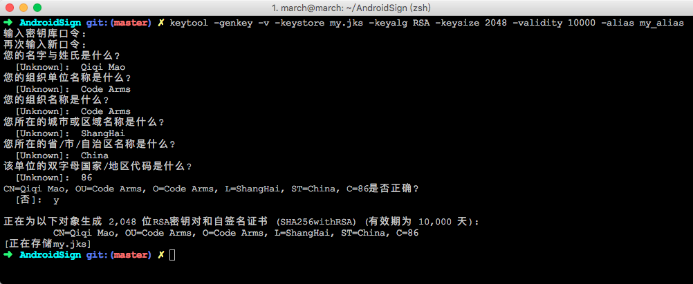

您可以输入如下命令来查看其详细信息：

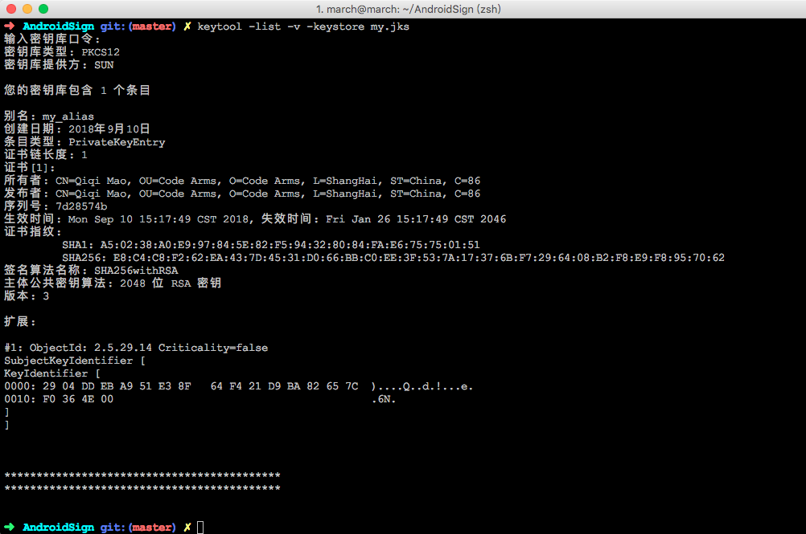

<h3 id="sign_use_command_line">从命令行签署您的应用</h3>

<h4 id="structure_unsigned_apk_and_signed_apk">构建未签署 APK 并签署 APK</h4>

1. 打开命令行，然后导航至项目的根目录。或者在 Android Studio 中，选择 View > Tool Windows > Terminal。然后调用 assembleRelease 任务：

    ```
    gradlew assembleRelease
    ```
    将会在 project_name/module_name/build/outputs/apk/ 中创建一个名为 module_name-unsigned.apk 的 APK。
    此 APK 此时处于未签署且未对齐的状态，使用您的私钥签署后才能安装。


2. 使用 zipalign 对齐未签署的 APK：

    ```
    zipalign -v -p 4 app-release-unsigned.apk app-release-unsigned-aligned.apk
    ```
    zipalign 可以确保所有未压缩的数据的开头均相对于文件开头部分执行特定的字节对齐，这样可减少应用消耗的 RAM 量。
    
    > 注：zipalign 命令在 Android SDK build-tools 中。

3. 通过 apksigner 使用您的私钥签署 APK：

    ```
    apksigner sign --ks my.jks --out app-release.apk app-release-unsigned-aligned.apk
    ```

    在本例中，在使用密钥库文件 my.jks 中存储的私钥和证书签署 APK 后，将以 app-release.apk 的形式输出签署的 APK。

    > 注：要使用 apksigner 工具，您必须已安装 Android SDK build-tools 的修订版 24.0.3 或更高版本。您可以使用 SDK 管理器更新此软件包。

4. 验证您的 APK 是否已签署：

    ```
    apksigner verify app-release.apk
    ```

5. 安装

    ```
    gradlew installDebug
    ```


<h4 id="sign_use_command_line_gradle">配置 Gradle 签署</h4>

1. 打开模块级 build.gradle 文件并添加带有 storeFile、storePassword、keyAlias 和 keyPassword 条目的 signingConfigs {} 块，
然后将该对象传递到您的构建类型中的 signingConfig 属性。例如：

    ```
    android {
        ...
        defaultConfig { ... }
        signingConfigs {
            config {
                storeFile file('sign/android_sign.jks')
                storePassword 'android_sign'
                keyAlias 'android_sign_alias'
                keyPassword 'android_sign_alias'
            }
            ...
        }
        buildTypes {
            release {
                signingConfig signingConfigs.config
                ...
            }
        }
    }
    ```

    > 注：在此情况下，密钥库和密钥密码可直接在 build.gradle 文件中查看。为提升安全性，您应[从您的构建文件中移除签署信息](#从您的构建文件中移除签署信息)。

2. 在您的项目根目录中打开一个命令行，并调用 assembleRelease 任务：

    ```
    gradlew assembleRelease
    ```

3. 将会在 project_name/module_name/build/outputs/apk/ 中创建一个名为 module_name-release.apk 的 APK。
这个 APK 文件已经使用 build.gradle 文件中指定的私钥签署，并使用 zipalign 进行了对齐。


<h2 id="sign_scheme_v2">Android 7.0 - APK signature scheme v2</h2>

Android 官网说明：[APK signature scheme v2][2]。

Android 7.0 引入一项新的应用签名方案 APK Signature Scheme v2，它能提供更快的应用安装时间和更多针对未授权 APK 文件更改的保护。

在默认情况下，Android Studio 2.2 和 Android Plugin for Gradle 2.2 会使用 APK Signature Scheme v2 和传统签名方案来签署您的应用。

如果您的应用在使用 APK Signature Scheme v2 时不能正确开发，您可以停用这项新方案。
禁用过程会导致 Android Studio 2.2 和 Android Plugin for Gradle 2.2 仅使用传统签名方案来签署您的应用。

<h3 id="sign_scheme_v2_android_studio_hand">手动签署 - 仅用传统方案签署</h3>

在[使用 Android Studio 签署您的应用](#sign_use_android_studio)的[手动签署](#sign_use_android_studio_hand)的第三步中，
在 Signature Versions 取消 V2（Full APK Signature）勾选。

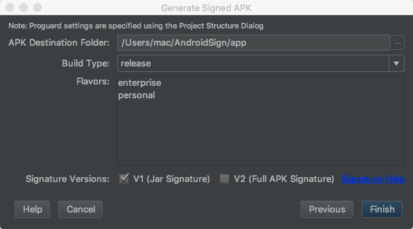

<h3 id="sign_scheme_v2_command_line_gradle">配置 Gradle 签署 - 仅用传统方案签署</h3>

打开模块级 build.gradle 文件，然后将行 v2SigningEnabled false 添加到您的版本签名配置中：

```
android {
    ...
    defaultConfig { ... }
    signingConfigs {
        config {
            storeFile file('sign/android_sign.jks')
            storePassword 'android_sign'
            keyAlias 'android_sign_alias'
            keyPassword 'android_sign_alias'
            v2SigningEnabled false
        }
    }
    ...
}
```

> 注：如果您使用 APK Signature Scheme v2 签署您的应用，并对应用进行了进一步更改，则应用的签名将无效。
出于这个原因，请在使用 APK Signature Scheme v2 签署您的应用之前、而非之后使用 zipalign 等工具。


## 运行您的应用

### 在模拟器上运行您的应用

#### 创建模拟器

您可以从头创建新的 AVD，也可以复制 AVD，然后更改一些属性。

要创建新的 AVD，请执行下列操作：

1. 在菜单栏中，点击手机图标。将会显示 Your Virtual Devices 界面。点击 Create Virtual Device 。

    
    
    或者，从 Android Studio 中运行您的应用。在 Select Deployment Target 对话框中，点击 Create New Virtual Device 。
    
    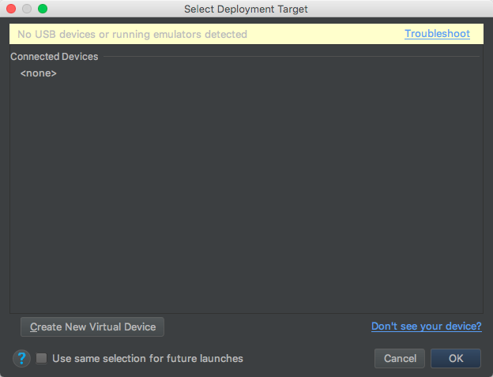
    
    将会显示 Select Hardware 页面。

    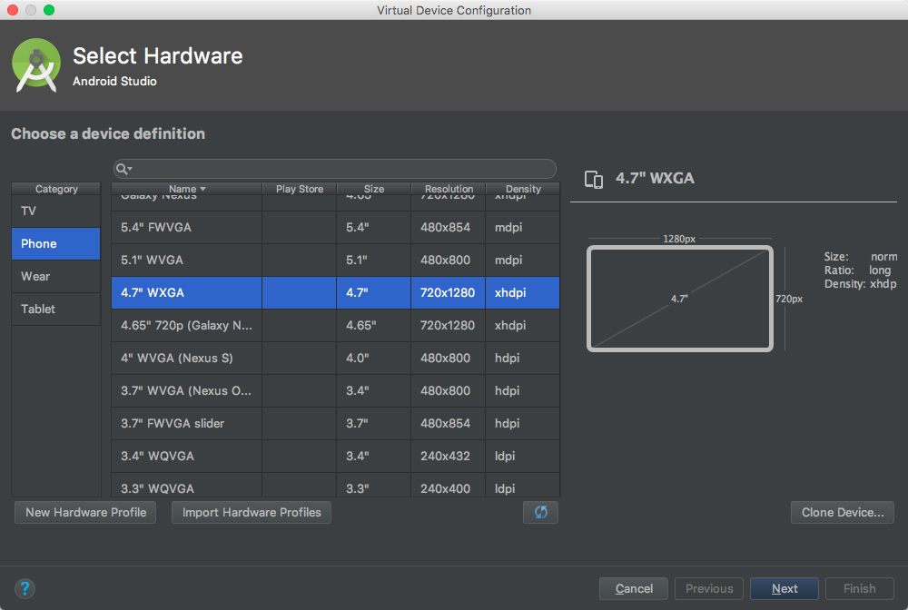

2. 选择硬件配置文件，然后点击 Next。将会显示 System Image 页面。

	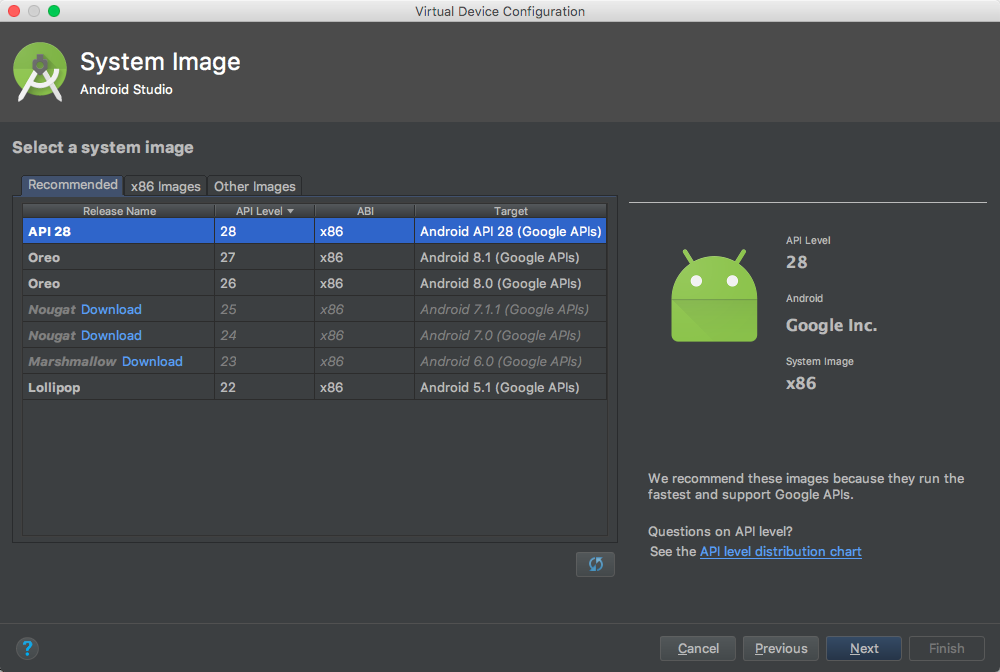

3. 选择针对特定 API 级别的系统映像，然后点击 Next。

	Recommended 标签会列出推荐的系统映像。其他标签包含更完整的列表。右窗格中介绍了选定的系统映像。x86 映像在模拟器中运行得最快。

	如果您在系统映像旁看到 Download 链接，点击它可以下载相应的系统映像。您必须连接到互联网才能下载。

	目标设备的 API 级别非常重要，因为您的应用将无法在 API 级别低于应用所需级别（在应用清单文件的 minSdkVersion 属性中定义）的系统映像上运行。

	如果您的应用在清单文件中声明了 <uses-library> 元素，应用会要求存在外部库的系统映像。如果您想要在模拟器上运行应用，请创建包含所需库的 AVD。
	为此，您需要使用适用于 AVD 平台的插件组件；例如包含 Google 地图库的 Google API 插件。

	将会显示 Verify Configuration 页面。

	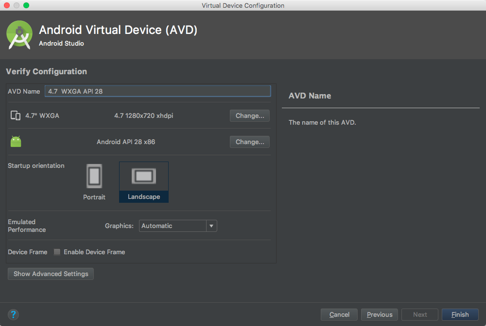

4. 根据需要更改 AVD 属性，然后点击 Finish。

	点击 Show Advanced Settings 显示更多设置，如皮肤。

	新 AVD 将显示在 Your Virtual Devices 页面或 Select Deployment Target 对话框中。

#### 命令行安装

有了 AVD 后，请启动 Android Emulator，然后执行以下操作安装您的应用：

1. 在命令行中，导航至 android_sdk/tools/，然后通过指定您的 AVD 启动模拟器：

    ```
    emulator -avd avd_name
    ```

    如果您不确定 AVD 名称，请执行 emulator -list-avds。

2. 现在，您可以使用上述 Gradle 安装任务或 adb 工具安装您的应用：

    ```
    adb install path/to/your_app.apk
    ```
    
    > 注：adb 命令在 Android SDK platform-tools 中。
    
    **警告**：[Error] adb install 报错 INSTALL_FAILED_TEST_ONLY: installPackageLI
    
    解决方法：adb install -t app-debug.apk#允许安装test用的apk

### 在设备上运行您的应用

您在设备上运行应用之前，必须在设备上启用 USB debugging。您可以在 Settings > Developer options 中找到该选项。

> 注：在运行 Android 4.2 及更新版本的设备上，Developer options 默认情况下处于隐藏状态。
如需将其显示出来，请转到 Settings > About phone 并点按 Build number 七次。
返回上一屏幕即可找到 Developer options。

对设备完成设置并通过 USB 连接后，您可以使用上述 Gradle 安装任务或 adb 工具安装您的应用。


## 发布您的应用

### 准备要发布的应用

1. 收集资料和资源。
2. 配置要发布的应用。

    * 关闭日志记录和调试
    * 清理项目目录
    * 查看并更新您的清单和 Gradle 构建设置

        **警告**：Google Play 允许的最大 versionCode 值为 2100000000。

        > 注：如果使用 Instant Run，Android Studio 会自动将 versionCode 设置为 MAXINT，将 versionName 设置为 INSTANTRUN。

3. 构建和签署发布版本的应用。

    您可以将 Gradle 构建文件与发布构建类型搭配使用，构建和签署发布版本的应用。

4. 测试发布版本的应用。

    在分发应用之前，您至少应在一个目标手机设备和一个目标平板电脑设备上对发布版本进行完全测试。

5. 更新要发布的应用资源。

    您需要确保多媒体文件和图形等所有应用资源都已更新并包含到您的应用中，或者暂存在适当的生产服务器上。

6. 准备您的应用依赖的远程服务器和服务。

	如果您的应用依赖外部服务器或服务，那么您需要确保它们是安全的并且已做好生产准备。

	作为准备流程的一部分，您还需要执行多个其他任务。例如，您需要获取一个私钥来签署应用。
	您还需要为应用创建一个图标，准备一份最终用户许可协议 (EULA) 来保护您的员工、组织和知识产权。

	完成要发布应用的准备工作后，您将获得一个签署的 .apk 文件，您可以将此文件分发给用户。


### 向用户发布应用

您可以通过多种方式发布您的 Android 应用。一般情况下，您需要通过一个应用市场（例如 Google Play）发布应用，不过，您也可以在自己的网站上发布应用，或者将其直接发送给用户。

* 通过应用市场发布
* 通过电子邮件发布应用
* 通过网站发布


[1]: https://developer.android.com/studio/publish/app-signing?hl=zh-cn
[2]: https://developer.android.google.cn/about/versions/nougat/android-7.0#apk_signature_v2